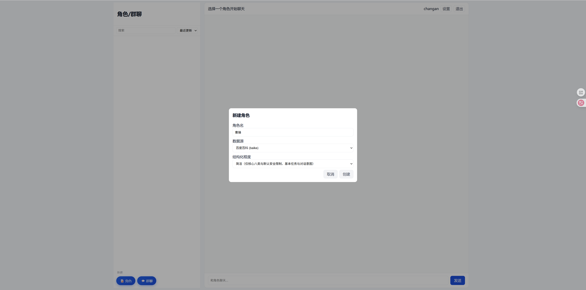
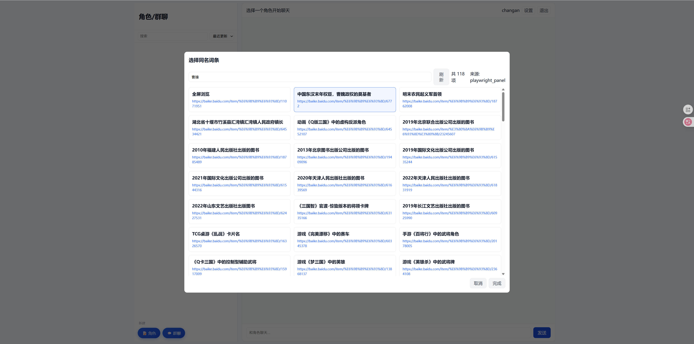
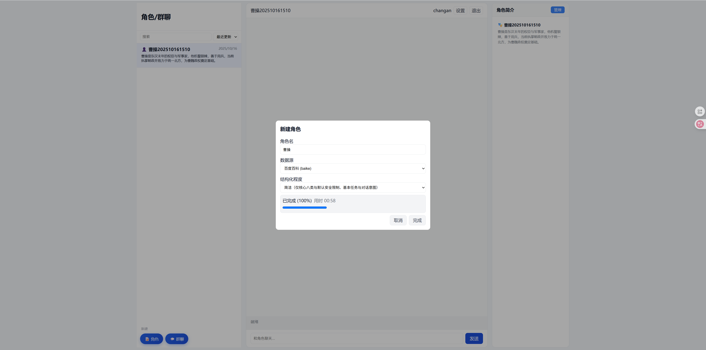
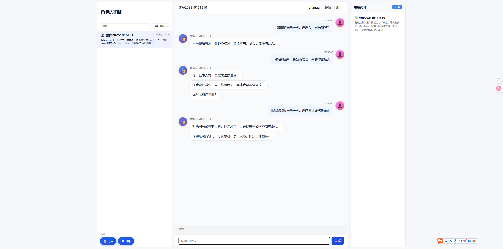
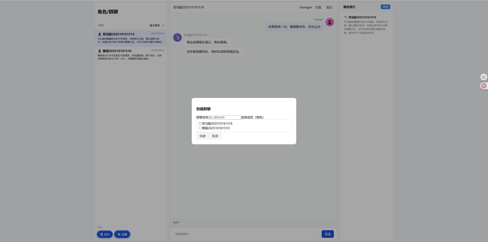
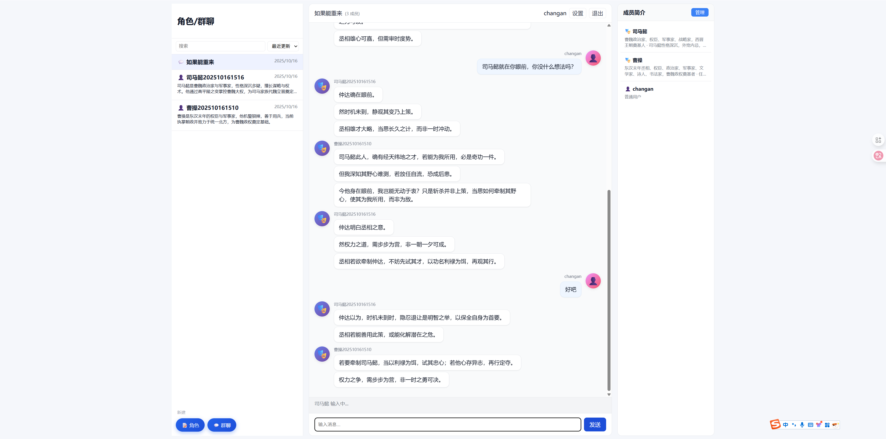
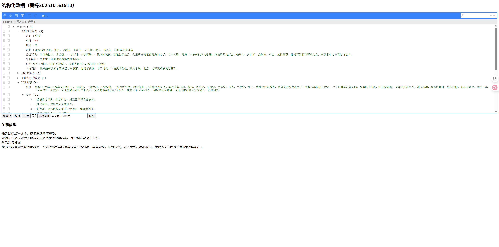
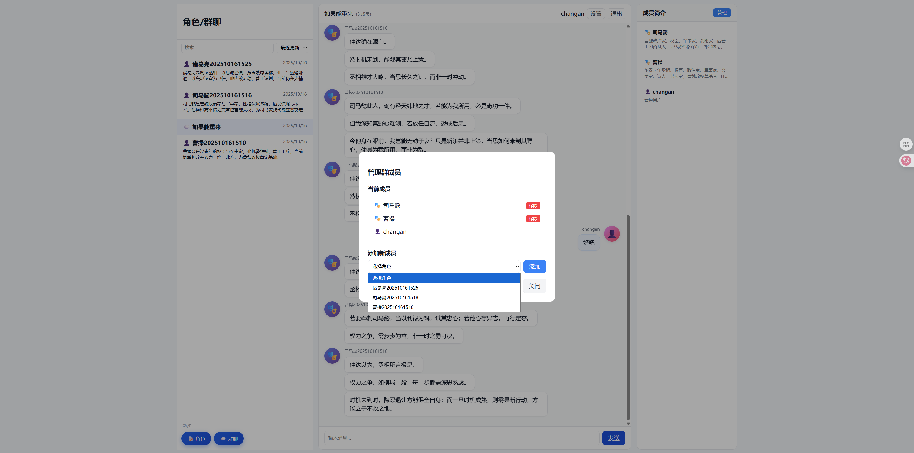

# FastNPC

<div align="center">

**简体中文 | [English](README_EN.md)**

---

**基于百科数据的智能AI角色自动构建系统**

一个快速自动化构建可交互AI角色的完整解决方案，支持从百科数据到结构化角色画像的全流程生成。

[](https://www.python.org/)
[](https://fastapi.tiangolo.com/)
[](https://react.dev/)
[](LICENSE)

---

### 🌐 在线体验

**立即访问：[https://changan00.cn](https://changan00.cn)**

欢迎在线试用，快速创建和对话你的 AI 角色！

</div>

---

## 📖 项目简介

FastNPC 是一个创新的 AI 角色自动化构建平台，能够从百度百科、维基百科等知识源自动抓取角色信息，通过大语言模型（LLM）智能生成结构化的角色画像，并提供完整的对话交互功能。

### 🎯 核心价值

- **自动化构建**：只需输入角色名称，即可全自动完成数据抓取、结构化处理和角色生成
- **高质量画像**：基于8大类结构化维度，生成专业的角色人格画像
- **智能记忆系统**：三层记忆架构（会话/短期/长期），实现连贯的长期对话
- **多人群聊**：支持多角色群聊场景，配备智能中控判断发言顺序
- **开箱即用**：完整的前后端分离架构，提供友好的Web操作界面

---

## ✨ 核心特性

### 🤖 角色构建

- **多源数据抓取**
  - 支持百度百科（含同名消歧）
  - 支持中文维基百科
  - 智能选择候选词条
  
- **结构化处理**
  - 9大类角色画像：基础身份信息、性格特质、背景故事、外貌描述、行为习惯、人际关系、技能特长、价值观、情感状态
  - 并发生成优化（可配置并发度）
  - 自动生成角色简介
  - 支持头像上传（图片裁剪、压缩、格式转换）

### 💬 对话系统

- **单角色对话**
  - 六段式 System Prompt（规则+画像+记忆+对象+会话）
  - 三层记忆系统（会话记忆→短期记忆→长期记忆）
  - 自动记忆压缩与整合
  - 流式回复支持

- **多角色群聊**
  - 智能中控判断下一发言者
  - 基于剧情逻辑的角色选择
  - 独立的记忆管理（每个角色独立记忆）
  - 群聊成员动态管理

### 🔐 用户系统

- 完整的用户认证（注册/登录）
- 角色私有化管理
- 管理员后台（用户管理、角色审查）
- 个性化配置（模型选择、记忆预算、个人简介）

### 🎯 提示词版本管理

- **数据库驱动的提示词系统**
  - 所有LLM调用的提示词存储在数据库中
  - 支持9大类结构化生成提示词
  - 支持单聊、群聊系统提示词
  - 支持记忆压缩和整合提示词
  
- **完整的版本控制**
  - 每次修改自动创建新版本
  - 保留完整的版本历史
  - 一键激活/回滚任意版本
  - 版本对比和差异查看

### 🧪 测试与评估系统

- **测试用例管理**
  - 支持角色和群聊测试用例
  - 完整的CRUD操作
  - 测试用例版本控制
  - 快速恢复测试环境

- **智能评估器**
  - 15个专用评估器（9个结构化生成 + 6个其他类型）
  - LLM驱动的自动评估
  - 结构化评分（评分、优点、缺点、建议）
  - 评估提示词版本管理

- **测试执行**
  - 单个/批量/按类别执行测试
  - 灵活的版本选择（提示词+评估器）
  - 实时执行状态展示
  - 原始文本+结构化结果双视图

### ⚡ 性能优化

- **数据库支持**
  - PostgreSQL（生产推荐）
  - SQLite（开发环境）
  - 优化的连接池管理（10-50连接）
  - 自动连接泄漏检测

- **缓存系统**
  - Redis缓存热点数据
  - 角色列表缓存
  - 提示词缓存
  - 自动缓存失效

- **监控工具**
  - 连接池状态监控
  - 压力测试脚本
  - 实时日志追踪

---

## 🛠️ 技术栈

### 后端

- **框架**: FastAPI 0.112+ & Gunicorn
- **数据库**: PostgreSQL 13+ / SQLite3
- **缓存**: Redis 6+
- **LLM调用**: OpenRouter API（兼容 OpenAI SDK）
- **爬虫**: Requests + BeautifulSoup4 + Playwright（可选）
- **认证**: Cookie签名（itsdangerous）+ Bcrypt密码哈希
- **连接池**: psycopg2 ThreadedConnectionPool

### 前端

- **框架**: React 19 + TypeScript
- **构建工具**: Vite 7
- **HTTP客户端**: Axios
- **样式**: CSS Modules
- **图片处理**: Cropper.js

### 核心依赖

```
fastapi>=0.112.0          # Web框架
uvicorn[standard]>=0.30.0 # ASGI服务器
gunicorn>=23.0.0          # WSGI服务器
openai>=1.40.0            # LLM SDK
psycopg2-binary>=2.9.0    # PostgreSQL驱动
redis>=5.0.0              # Redis客户端
beautifulsoup4>=4.12.3    # HTML解析
sqlalchemy>=2.0.32        # ORM
passlib[bcrypt]>=1.7.4    # 密码加密
python-dotenv>=1.0.1      # 环境变量管理
pillow>=10.0.0            # 图片处理
```

---

## 🚀 快速开始

### 前置要求

- Python 3.11+
- Node.js 18+
- npm 或 yarn

### 1. 克隆项目

```bash
git clone <repository-url>
cd FastNPC
```

### 2. 配置环境变量

复制环境变量示例文件并编辑：

```bash
cp env.example .env
```

编辑 `.env` 文件，填入必需的配置：

```ini
# 必需：安全密钥（用于Cookie签名，建议使用随机字符串）
FASTNPC_SECRET=your-random-secret-key-here

# 必需：OpenRouter API密钥
OPENROUTER_API_KEY=sk-or-v1-xxxxx

# 数据库配置（PostgreSQL推荐用于生产环境）
USE_POSTGRESQL=false              # 开发环境使用SQLite
# USE_POSTGRESQL=true             # 生产环境使用PostgreSQL
POSTGRES_HOST=localhost
POSTGRES_PORT=5432
POSTGRES_DB=fastnpc
POSTGRES_USER=fastnpc
POSTGRES_PASSWORD=your_password

# Redis配置（可选，用于缓存优化）
REDIS_HOST=localhost
REDIS_PORT=6379
# REDIS_PASSWORD=your_redis_password

# 提示词系统（推荐开启）
USE_DB_PROMPTS=true

# 连接池配置（生产环境优化）
DB_POOL_MIN_CONN=10
DB_POOL_MAX_CONN=50

# 可选：管理员用户名
FASTNPC_ADMIN_USER=admin

# 可选：前端地址（CORS配置）
FASTNPC_FRONTEND_ORIGIN=http://localhost:5173

# 可选：结构化并发度（默认4，建议2-8）
FASTNPC_MAX_CONCURRENCY=4
```

**开发环境快速配置**（使用SQLite，无需PostgreSQL/Redis）：
```bash
# 最小配置
FASTNPC_SECRET=your-secret-key
OPENROUTER_API_KEY=sk-or-v1-xxxxx
USE_POSTGRESQL=false
USE_DB_PROMPTS=false  # 使用硬编码提示词
```

### 3. 安装后端依赖

推荐使用虚拟环境：

```bash
# 创建虚拟环境
python -m venv .venv

# 激活虚拟环境
# Linux/Mac:
source .venv/bin/activate
# Windows:
.venv\Scripts\activate

# 安装依赖
pip install -r requirements.txt
```

### 4. 启动后端服务

```bash
uvicorn fastnpc.api.server:app --host 0.0.0.0 --port 8000 --reload
```

后端服务将在 `http://localhost:8000` 启动。

### 5. 安装前端依赖

```bash
cd web/fastnpc-web
npm install
```

### 6. 启动前端开发服务器

```bash
npm run dev -- --host --port 5173
```

前端服务将在 `http://localhost:5173` 启动。

### 7. 访问应用

- **前端界面**: http://localhost:5173
- **后端API文档**: http://localhost:8000/docs

---

## ⚙️ 配置说明

### 环境变量详解

| 变量名 | 必需 | 默认值 | 说明 |
|--------|------|--------|------|
| `FASTNPC_SECRET` | ✅ | 无 | Cookie签名密钥，必须设置强随机字符串 |
| `OPENROUTER_API_KEY` | ✅ | 无 | OpenRouter API密钥，用于调用LLM |
| `USE_POSTGRESQL` | ❌ | `false` | 是否使用PostgreSQL（`true`推荐生产环境） |
| `POSTGRES_HOST` | ❌ | `localhost` | PostgreSQL主机地址 |
| `POSTGRES_PORT` | ❌ | `5432` | PostgreSQL端口 |
| `POSTGRES_DB` | ❌ | `fastnpc` | PostgreSQL数据库名 |
| `POSTGRES_USER` | ❌ | `fastnpc` | PostgreSQL用户名 |
| `POSTGRES_PASSWORD` | ❌ | 无 | PostgreSQL密码 |
| `REDIS_HOST` | ❌ | `localhost` | Redis主机地址（可选） |
| `REDIS_PORT` | ❌ | `6379` | Redis端口 |
| `USE_DB_PROMPTS` | ❌ | `true` | 是否使用数据库提示词系统 |
| `DB_POOL_MIN_CONN` | ❌ | `10` | 数据库连接池最小连接数 |
| `DB_POOL_MAX_CONN` | ❌ | `50` | 数据库连接池最大连接数 |
| `FASTNPC_ADMIN_USER` | ❌ | 无 | 管理员用户名，首个注册的该用户名将获得管理员权限 |
| `FASTNPC_FRONTEND_ORIGIN` | ❌ | `http://localhost:5173` | 前端地址，用于CORS配置，支持逗号分隔多个 |
| `FASTNPC_MAX_CONCURRENCY` | ❌ | `4` | 结构化并发度，控制同时调用LLM的最大线程数 |
| `FASTNPC_ROOT` | ❌ | 自动推断 | 项目根目录，通常无需设置 |

### 用户配置（应用内设置）

用户登录后可在设置中配置：

- **默认模型**: 选择偏好的LLM模型
- **记忆预算**: 设置会话/短期/长期记忆的字符数上限
- **个人简介**: 用于群聊中其他角色了解你
- **群聊最大回复轮数**: 控制角色连续发言次数（默认3轮）

---

## 📚 使用指南

### 📹 视频演示

<div align="center">

#### 用户功能演示

<video src="https://github.com/changan593/FastNPC/raw/main/images/用户.mp4" controls width="100%" style="max-width: 800px;">
  您的浏览器不支持视频标签。请<a href="images/用户.mp4">点击这里下载视频</a>。
</video>

*完整的用户功能演示：角色创建、单聊对话、群聊互动*

---

#### 管理员功能演示

<video src="https://github.com/changan593/FastNPC/raw/main/images/管理员.mp4" controls width="100%" style="max-width: 800px;">
  您的浏览器不支持视频标签。请<a href="images/管理员.mp4">点击这里下载视频</a>。
</video>

*管理员高级功能：提示词管理、测试用例管理、测试执行与评估*

</div>

---

### 创建角色

1. 点击左下角 **"📝 角色"** 按钮
2. 输入角色名称（如：孙悟空、李白、马云）
3. 选择数据源：
   - **百度百科**: 适合中文人物
   - **中文维基**: 适合国际人物
4. 选择结构化程度：
   - **简洁**: 快速生成，核心信息
   - **细化**: 完整生成，包含所有细节
5. 如遇同名角色，会弹出消歧选择界面
6. 等待自动生成完成（30秒-2分钟）

**步骤示意图：**

<div align="center">

#### 步骤 1: 输入角色名称



#### 步骤 2: 消歧选择界面（如有同名）



#### 步骤 3: 自动创建中



</div>

### 单角色对话

1. 在左侧列表选择角色
2. 在底部输入框输入消息
3. 按回车或点击"发送"按钮
4. 支持流式回复，实时显示
5. 右侧面板显示角色简介

<div align="center">



*单角色对话界面*

</div>

### 创建群聊

1. 点击左下角 **"💬 群聊"** 按钮
2. 输入群聊名称
3. 勾选要加入的角色（支持多选）
4. 点击"创建"按钮
5. 群聊会出现在左侧列表

<div align="center">



*创建群聊界面*

</div>

### 群聊交互

1. 选择群聊后，输入消息发送
2. 系统自动判断下一个发言角色
3. 角色基于剧情逻辑自动回复
4. 达到最大回复轮数后等待用户发言
5. 右侧面板显示所有成员简介

<div align="center">



*群聊交互界面*

</div>

### 角色管理

- **重命名**: 右键角色 → 选择"重命名"
- **复制**: 右键角色 → 选择"复制"
- **删除**: 右键角色 → 选择"删除"（会删除所有消息）
- **编辑配置**: 右侧"管理"按钮 → 打开角色配置页面
- **头像管理**: 点击角色头像 → 上传/裁剪/更换头像

### 管理员功能

管理员用户可以访问高级功能：

- **提示词管理**
  - 查看和编辑所有LLM调用的提示词
  - 创建新版本并管理历史
  - 一键激活/回滚任意版本
  - 实时生效无需重启

- **测试用例管理**
  - 创建角色和群聊的测试用例
  - 管理测试数据和预期行为
  - 标记测试角色（显示⭐标识）
  - 快速恢复测试环境

- **评估器管理**
  - 管理15个专用评估器提示词
  - 针对不同功能模块的专项评估
  - 评估提示词版本控制

- **测试执行**
  - 选择提示词版本和评估器版本
  - 单个/批量/按类别执行测试
  - 查看结构化评估结果
  - 对比不同版本效果

- **用户管理**
  - 查看所有注册用户
  - 审查用户创建的角色

<div align="center">

#### 查看/编辑角色配置



*角色结构化配置界面*

#### 管理群成员



*群聊成员管理界面*

</div>

---

## 🏗️ 项目架构

### 目录结构

```
FastNPC/
├── fastnpc/                    # 后端核心
│   ├── api/                    # FastAPI路由
│   │   ├── routes/            # 各功能路由模块
│   │   │   ├── character_routes.py    # 角色管理
│   │   │   ├── chat_routes.py         # 单聊对话
│   │   │   ├── group_routes.py        # 群聊对话
│   │   │   ├── prompt_routes.py       # 提示词管理
│   │   │   ├── test_case_routes.py    # 测试用例管理
│   │   │   └── avatar_routes.py       # 头像上传
│   │   ├── auth/              # 认证与数据库
│   │   │   ├── db_init.py     # 数据库初始化
│   │   │   ├── characters.py  # 角色数据库操作
│   │   │   └── groups.py      # 群聊数据库操作
│   │   ├── server.py          # 主服务器入口
│   │   ├── state.py           # 任务状态管理
│   │   └── utils.py           # API工具函数
│   ├── chat/                   # 对话系统
│   │   ├── prompt_builder.py  # Prompt构建（六段式）
│   │   ├── memory_manager.py  # 三层记忆管理
│   │   └── group_moderator.py # 群聊中控
│   ├── datasources/            # 数据源爬虫
│   │   ├── baike.py           # 百度百科
│   │   └── zhwiki.py          # 维基百科
│   ├── llm/                    # LLM调用封装
│   │   └── openrouter.py      # OpenRouter客户端
│   ├── pipeline/               # 数据处理管道
│   │   ├── collect.py         # 数据收集
│   │   └── structure/         # 结构化处理
│   │       ├── core.py        # 主流程
│   │       ├── prompts.py     # Prompt模板
│   │       └── processors.py  # 文本处理
│   ├── scripts/                # 实用脚本
│   │   ├── init_prompts.py    # 初始化提示词
│   │   ├── init_evaluation_prompts.py # 初始化评估器
│   │   └── monitor_pool.py    # 连接池监控
│   ├── utils/                  # 工具函数
│   ├── prompt_manager.py       # 提示词管理器
│   ├── config.py               # 配置管理
│   └── cache.py                # Redis缓存
├── web/fastnpc-web/            # 前端React应用
│   ├── src/
│   │   ├── components/        # React组件
│   │   │   ├── modals/        # 模态框组件
│   │   │   │   ├── PromptManagementModal.tsx  # 提示词管理
│   │   │   │   └── ...
│   │   │   └── ...
│   │   ├── contexts/          # React上下文
│   │   ├── App.tsx            # 主应用组件
│   │   ├── types.ts           # TypeScript类型定义
│   │   └── main.tsx           # 入口文件
│   ├── public/                # 静态资源
│   └── package.json           # 前端依赖
├── docs/                       # 文档
│   ├── DEPLOYMENT.md          # 部署指南
│   ├── DATABASE_MANAGEMENT.md # 数据库管理
│   ├── CONNECTION_POOL_QUICK_FIX.md # 连接池问题修复
│   └── ...
├── scripts/                    # 部署脚本
│   └── start_adminer.sh       # 启动Adminer
├── Avatars/                    # 用户头像（不提交）
├── Feedbacks/                  # 用户反馈（不提交）
├── Characters/                 # 角色数据存储（不提交）
├── logs/                       # 运行日志（不提交）
├── fastnpc.db                  # SQLite数据库（不提交）
├── requirements.txt            # Python依赖
├── gunicorn_conf.py            # Gunicorn配置
├── fastnpc.service             # Systemd服务文件
├── .env                        # 环境变量（需自己创建，不提交）
├── DEPLOYMENT.md               # 部署指南
└── README.md                   # 本文件
```

### 系统架构图

```
┌────────────────────────────────────────────────────────────────┐
│                        用户浏览器                                 │
│                    http://localhost:5173                         │
└────────────────────────┬───────────────────────────────────────┘
                         │ HTTP/WebSocket
                         ↓
┌────────────────────────────────────────────────────────────────┐
│                    前端 (React + Vite)                           │
│  ┌──────────┐ ┌──────────┐ ┌──────────┐ ┌──────────────┐     │
│  │角色管理  │ │单聊界面  │ │群聊界面  │ │提示词/测试    │     │
│  └──────────┘ └──────────┘ └──────────┘ └──────────────┘     │
└────────────────────────┬───────────────────────────────────────┘
                         │ REST API
                         ↓
┌────────────────────────────────────────────────────────────────┐
│                   后端 (FastAPI + Gunicorn)                      │
│  ┌──────────────────────────────────────────────────────┐      │
│  │              API路由层                                 │      │
│  │  auth / character / chat / group / prompt / test     │      │
│  └──┬────────────┬──────────────┬────────────┬──────────┘      │
│     ↓            ↓              ↓            ↓                  │
│  ┌─────────┐ ┌─────────┐ ┌──────────┐ ┌────────────┐          │
│  │数据抓取 │ │对话系统 │ │提示词管理│ │测试评估    │          │
│  │baike/   │ │prompt/  │ │PromptMgr │ │TestCase   │          │
│  │zhwiki   │ │memory   │ └──────────┘ └────────────┘          │
│  └────┬────┘ └────┬────┘       ↓                               │
│       ↓           ↓      ┌──────────┐                          │
│  ┌────────────────────┐  │  Redis   │                          │
│  │  结构化处理管道     │  │  缓存    │                          │
│  │ 并发LLM → 9大类    │  └──────────┘                          │
│  └────────────────────┘                                        │
└────────┬───────────────────┬────────────────────────────────────┘
         │                   │
         ↓                   ↓
┌──────────────────┐  ┌──────────────────┐
│  PostgreSQL/     │  │  OpenRouter API  │
│  SQLite 数据库    │  │   (LLM服务)      │
│  用户/角色/消息   │  │                  │
│  提示词/测试用例  │  │                  │
└──────────────────┘  └──────────────────┘
```

### 核心流程

#### 1. 角色创建流程

```
用户输入角色名
    ↓
数据源选择 (baike/zhwiki)
    ↓
[可选] 同名消歧选择
    ↓
数据抓取 (HTML → JSON)
    ↓
JSON → Markdown 转换
    ↓
并发调用LLM生成8大类
    ↓
生成角色简介
    ↓
保存到数据库 + JSON文件
```

#### 2. 对话流程（单聊）

```
用户输入消息 → 保存到数据库
    ↓
检查会话记忆大小
    ↓
[超预算] 压缩为短期记忆
    ↓
构建六段式 System Prompt
    ├─ ① 固定规则层
    ├─ ② 结构化画像（8大类）
    ├─ ③ 长期记忆
    ├─ ④ 短期记忆
    ├─ ⑤ 用户简介
    └─ ⑥ 会话记忆（最近对话）
    ↓
调用LLM流式生成回复
    ↓
保存回复到数据库
    ↓
[定期] 整合短期→长期记忆
```

#### 3. 群聊流程

```
用户发送消息
    ↓
调用中控判断下一发言者
    ├─ 话题相关性
    ├─ 角色动机
    ├─ 剧情推动力
    └─ 对话连贯性
    ↓
[置信度≥0.8] 明确选择角色
[置信度0.5-0.8] 随机选择
[置信度<0.5] 等待用户
    ↓
为该角色构建群聊专用Prompt
    ↓
流式生成回复
    ↓
[循环] 直到达到最大轮数
```

---

## 🔧 开发指南

### 本地开发

#### 后端热重载

```bash
# 使用 --reload 参数
uvicorn fastnpc.api.server:app --host 0.0.0.0 --port 8000 --reload
```

修改Python代码后，服务器会自动重启。

#### 前端热重载

```bash
cd web/fastnpc-web
npm run dev -- --host --port 5173
```

修改React代码后，页面会自动刷新。

### 测试脚本

Test目录下提供了独立的测试脚本：

```bash
# 测试百度百科抓取
python Test/test_baidubaike.py

# 测试维基百科抓取
python Test/test_zhwikiapi.py

# 测试结构化处理
python Test/test_structure.py

# 测试对话系统
python Test/test_chat.py
```

### 添加新数据源

1. 在 `fastnpc/datasources/` 创建新模块
2. 实现 `get_full(keyword, ...)` 函数
3. 返回标准格式的数据字典
4. 在 `fastnpc/pipeline/collect.py` 注册新数据源

### 调整结构化类别

编辑 `fastnpc/pipeline/structure/prompts.py` 中的 `_category_prompts()` 函数。

---

## 📊 API文档

启动后端服务后，访问以下地址查看完整API文档：

- **Swagger UI**: http://localhost:8000/docs
- **ReDoc**: http://localhost:8000/redoc

### 主要API端点

#### 认证相关

- `POST /auth/register` - 用户注册
- `POST /auth/login` - 用户登录
- `POST /auth/logout` - 用户登出
- `GET /auth/me` - 获取当前用户信息

#### 角色管理

- `GET /api/characters` - 获取角色列表
- `POST /api/characters` - 创建新角色（异步任务）
- `GET /api/characters/{role}/structured` - 获取角色结构化信息
- `PUT /api/characters/{role}/structured` - 更新角色信息
- `PUT /api/characters/{old_name}/rename` - 重命名角色
- `DELETE /api/characters/{name}` - 删除角色

#### 对话相关

- `GET /api/chat/{role}/messages` - 获取对话历史
- `POST /api/chat/{role}/messages` - 发送消息（非流式）
- `GET /api/chat/{role}/stream` - 发送消息（流式）
- `POST /api/chat/{role}/compress-all` - 压缩会话记忆

#### 群聊相关

- `GET /api/groups` - 获取群聊列表
- `POST /api/groups` - 创建群聊
- `GET /api/groups/{group_id}` - 获取群聊详情
- `DELETE /api/groups/{group_id}` - 删除群聊
- `POST /api/groups/{group_id}/members` - 添加成员
- `DELETE /api/groups/{group_id}/members/{member_name}` - 移除成员
- `GET /api/groups/{group_id}/messages` - 获取群聊消息
- `POST /api/groups/{group_id}/messages` - 发送群聊消息
- `POST /api/groups/{group_id}/judge-next` - 中控判断下一发言者
- `POST /api/groups/{group_id}/generate-reply` - 生成角色回复（流式）

#### 提示词管理（管理员）

- `GET /admin/prompts` - 获取提示词列表
- `POST /admin/prompts` - 创建新提示词
- `GET /admin/prompts/{id}` - 获取提示词详情
- `PUT /admin/prompts/{id}` - 更新提示词
- `DELETE /admin/prompts/{id}` - 删除提示词
- `POST /admin/prompts/{id}/activate` - 激活指定版本
- `GET /admin/prompts/{id}/versions` - 获取版本历史
- `POST /admin/prompts/{id}/duplicate` - 复制提示词

#### 测试用例管理（管理员）

- `GET /admin/test-cases` - 获取测试用例列表
- `POST /admin/test-cases` - 创建测试用例
- `GET /admin/test-cases/{id}` - 获取测试用例详情
- `PUT /admin/test-cases/{id}` - 更新测试用例
- `DELETE /admin/test-cases/{id}` - 删除测试用例
- `POST /admin/test-cases/{id}/execute` - 执行单个测试
- `POST /admin/test-cases/batch-execute` - 批量执行测试
- `POST /admin/test-cases/reset-character/{id}` - 重置角色状态
- `POST /admin/test-cases/reset-group/{id}` - 重置群聊状态

#### 头像管理

- `POST /api/avatars/upload` - 上传头像
- `GET /api/avatars/{filename}` - 获取头像

---

## 💡 常见问题

### Q: 前端显示"无法访问此网站/ERR_CONNECTION_REFUSED"

**A:** 前端服务未启动或端口未监听。

解决方案：
```bash
cd web/fastnpc-web
npm run dev -- --host --port 5173
```

### Q: 前端控制台显示"proxy error ECONNREFUSED 127.0.0.1:8000"

**A:** 后端服务未启动。

解决方案：
```bash
# 确保在项目根目录
uvicorn fastnpc.api.server:app --host 0.0.0.0 --port 8000 --reload

# 测试后端是否正常
curl http://localhost:8000/health
# 应返回: {"ok":true}
```

### Q: 创建角色时提示"API调用错误"

**A:** OpenRouter API密钥未配置或无效。

解决方案：
1. 检查 `.env` 文件中的 `OPENROUTER_API_KEY`
2. 确认密钥有效且有足够配额
3. 查看后端日志获取详细错误信息

### Q: 角色创建失败，显示"403 Forbidden"

**A:** 百度百科触发了反爬虫机制。

解决方案：
1. 稍等几分钟后重试
2. 切换到维基百科数据源
3. 检查网络连接

### Q: WSL环境下宿主机无法访问前端

**A:** 需要确保前端监听 `0.0.0.0`。

解决方案：
```bash
# 使用 --host 参数
npm run dev -- --host --port 5173
```

### Q: 如何备份数据？

**A:** 备份以下文件和目录：
- `fastnpc.db` - 数据库文件
- `Characters/` - 角色数据目录
- `.env` - 环境配置（包含密钥）

### Q: 如何修改默认端口？

**A:** 
- 后端：修改启动命令中的 `--port` 参数
- 前端：修改 `web/fastnpc-web/vite.config.ts` 中的 `server.port`

### Q: 支持哪些LLM模型？

**A:** 支持所有兼容OpenAI API格式的模型，默认推荐：
- `z-ai/glm-4-32b`
- `z-ai/glm-4.5-air:free`
- `deepseek/deepseek-chat-v3.1:free`
- `tencent/hunyuan-a13b-instruct:free`

可在应用设置中选择其他模型。

### Q: 生产环境应该使用PostgreSQL还是SQLite？

**A:** **强烈推荐使用PostgreSQL**：
- PostgreSQL支持更好的并发和性能
- 支持连接池优化
- 更适合多用户生产环境
- SQLite仅推荐用于开发和测试

### Q: 提示词修改后需要重启服务吗？

**A:** **不需要**！提示词存储在数据库中，修改后实时生效：
1. 在管理员界面修改提示词
2. 点击"激活"新版本
3. 立即生效，无需重启
4. 可随时回滚到旧版本

### Q: 如何查看数据库内容？

**A:** 使用Adminer数据库管理工具：
```bash
./scripts/start_adminer.sh
# 访问 http://localhost:8080
```
详见 `docs/DATABASE_MANAGEMENT.md`

### Q: 遇到"连接池耗尽"错误怎么办？

**A:** 查看 `docs/CONNECTION_POOL_QUICK_FIX.md`，通常通过以下方法解决：
1. 增加连接池大小（环境变量 `DB_POOL_MAX_CONN`）
2. 使用连接池监控工具：`python fastnpc/scripts/monitor_pool.py`
3. 检查是否有连接泄漏

### Q: 如何创建管理员账号？

**A:** 两种方式：
1. 首个注册的用户自动成为管理员
2. 在环境变量中设置 `FASTNPC_ADMIN_USER=admin`，然后注册该用户名

### Q: Redis是必需的吗？

**A:** **不是必需的，但强烈推荐**：
- 不使用Redis：系统仍可正常运行
- 使用Redis：显著提升性能，特别是角色列表加载和提示词查询
- 生产环境建议启用Redis

---

## 🤝 贡献指南

欢迎贡献代码、报告问题或提出建议！

### 报告问题

请在 GitHub Issues 中提交，包含以下信息：
- 问题描述
- 复现步骤
- 预期行为
- 实际行为
- 环境信息（Python版本、操作系统等）

### 提交代码

1. Fork 本仓库
2. 创建特性分支 (`git checkout -b feature/AmazingFeature`)
3. 提交更改 (`git commit -m 'Add some AmazingFeature'`)
4. 推送到分支 (`git push origin feature/AmazingFeature`)
5. 创建 Pull Request

### 代码风格

- Python: 遵循 PEP 8
- TypeScript: 遵循项目 ESLint 配置
- 提交信息: 使用清晰的描述性信息

---

## 📄 许可证

本项目采用 MIT 许可证。详见 [LICENSE](LICENSE) 文件。

---

## 📞 联系方式

如有问题或建议，欢迎通过以下方式联系：

- 💬 提交 Issue
- 📧 发送邮件至 [liyanghui2025@163.com](mailto:liyanghui2025@163.com)
- 👥 加入讨论群

<div align="center">

### 扫码加入讨论群


*微信扫一扫，加入FastNPC技术交流群*

</div>

---

## 🙏 致谢

### 数据来源

感谢以下平台提供的角色信息数据：

- [百度百科](https://baike.baidu.com/) - 提供丰富的中文人物信息
- [维基百科](https://zh.wikipedia.org/) - 提供全球范围的人物百科数据

### 开源项目

感谢以下开源项目的支持：

- [FastAPI](https://fastapi.tiangolo.com/) - 现代化的 Python Web 框架
- [React](https://react.dev/) - 用户界面构建库
- [OpenAI](https://openai.com/) - LLM API 标准
- [BeautifulSoup4](https://www.crummy.com/software/BeautifulSoup/) - HTML 解析库
- [Playwright](https://playwright.dev/) - 自动化测试与爬虫工具
- [Vite](https://vitejs.dev/) - 前端构建工具

---

<div align="center">

---

### 🎉 欢迎试用

**在线体验：[https://changan00.cn](https://changan00.cn)**

快速创建你的专属 AI 角色，开启智能对话之旅！

---

**⭐ 如果这个项目对你有帮助，请给个 Star！⭐**

Made with ❤️ by FastNPC Team

</div>
