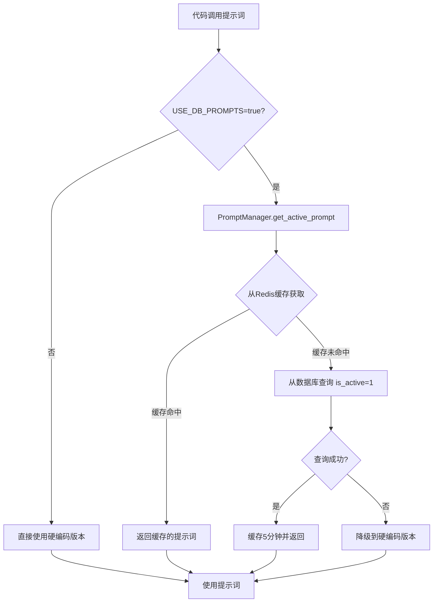
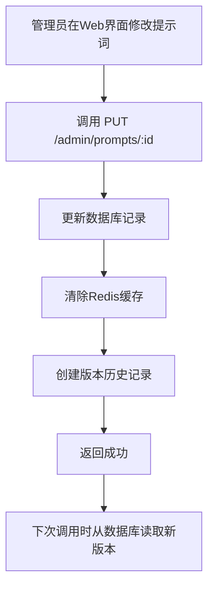
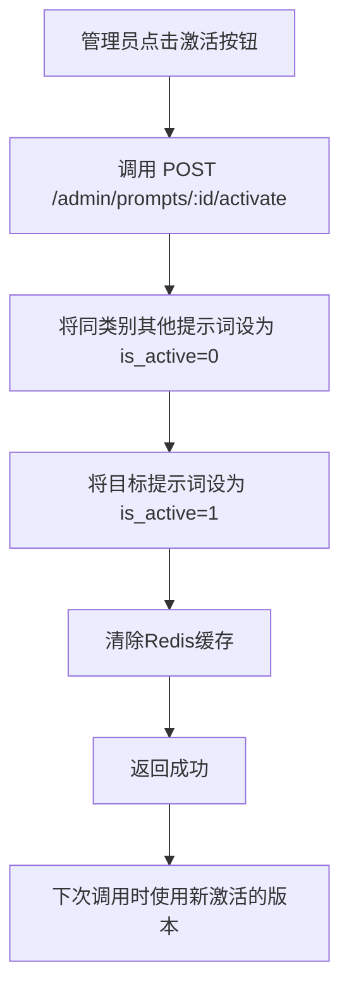

# 提示词版本控制系统集成状态报告

**生成日期**: 2025-10-19  
**状态**: ✅ 已完全集成并默认启用

---

## 📊 集成状态总览

### ✅ 配置状态

**配置文件**: `fastnpc/config.py`

```python
USE_DB_PROMPTS: bool = os.environ.get("USE_DB_PROMPTS", "true").lower() in ("true", "1", "yes")
```

**当前状态**: 
- ✅ **默认启用** - 系统默认从数据库读取提示词
- ✅ 支持环境变量覆盖 - 可通过 `.env` 文件或环境变量控制
- ✅ 具有降级机制 - 数据库失败时自动降级到硬编码版本

---

## 🎯 已集成的提示词类别

### 1. 结构化生成提示词（9个子分类）

**模块**: `fastnpc/pipeline/structure/prompts.py`  
**函数**: `_category_prompts()`  
**状态**: ✅ 已集成

**子分类列表**:
1. 基础身份信息 (`基础身份信息`)
2. 个性与行为设定 (`个性与行为设定`)
3. 背景故事 (`背景故事`)
4. 知识与能力 (`知识与能力`)
5. 对话与交互规范 (`对话与交互规范`)
6. 任务/功能性信息 (`任务/功能性信息`)
7. 环境与世界观 (`环境与世界观`)
8. 系统与控制参数 (`系统与控制参数`)
9. 来源 (`来源`)

**代码位置**: 第25-50行

```python
if USE_DB_PROMPTS:
    try:
        prompts_dict = {}
        categories = [...]
        for category in categories:
            prompt_data = PromptManager.get_active_prompt(
                PromptCategory.STRUCTURED_GENERATION,
                sub_category=category
            )
            if prompt_data:
                template = prompt_data['template_content']
                rendered = PromptManager.render_prompt(template, {"persona_name": persona_name})
                prompts_dict[category] = rendered
        return prompts_dict
    except Exception as e:
        print(f"[WARN] 从数据库加载提示词失败: {e}，降级到硬编码版本")
```

---

### 2. 结构化系统消息

**模块**: `fastnpc/pipeline/structure/prompts.py`  
**函数**: `_call_category_llm()`  
**状态**: ✅ 已集成  
**类别**: `STRUCTURED_SYSTEM_MESSAGE`

**代码位置**: 第151-166行

---

### 3. 简介生成提示词

**模块**: `fastnpc/pipeline/structure/prompts.py`  
**函数**: `_generate_persona_brief()`  
**状态**: ✅ 已集成  
**类别**: `BRIEF_GENERATION`

**代码位置**: 第225-240行

**支持变量替换**:
- `{persona_name}` - 角色名称
- `{person}` - 人称（第一/第三人称）
- `{role_json}` - 角色结构化JSON

---

### 4. 单聊系统提示词

**模块**: `fastnpc/chat/prompt_builder.py`  
**函数**: `build_single_chat_prompt()`  
**状态**: ✅ 已集成  
**类别**: `SINGLE_CHAT_SYSTEM`

**代码位置**: 第153-167行

**支持变量替换**:
- `{display_name}` - 角色显示名称
- `{user_name}` - 用户名称

---

### 5. 短期记忆凝练提示词

**模块**: `fastnpc/chat/memory_manager.py`  
**函数**: `_get_stm_compression_prompt()`  
**状态**: ✅ 已集成

**分类**:
- `SINGLE_CHAT_STM_COMPRESSION` - 单聊短期记忆凝练
- `GROUP_CHAT_STM_COMPRESSION` - 群聊短期记忆凝练

**代码位置**: 第137-150行

---

### 6. 长期记忆整合提示词

**模块**: `fastnpc/chat/memory_manager.py`  
**函数**: `_get_ltm_integration_prompt()`  
**状态**: ✅ 已集成  
**类别**: `LTM_INTEGRATION`

**代码位置**: 第153-165行

---

### 7. 群聊中控提示词

**模块**: `fastnpc/chat/group_moderator.py`  
**函数**: `select_next_speaker()`  
**状态**: ✅ 已集成  
**类别**: `GROUP_MODERATOR`

**代码位置**: 第83-94行

**支持变量替换**:
- `{participants}` - 参与者列表
- `{recent_messages}` - 最近消息

---

### 8. 群聊角色发言系统提示词

**模块**: `fastnpc/api/routes/group_routes.py`  
**函数**: `group_chat_stream()`  
**状态**: ✅ 已集成  
**类别**: `GROUP_CHAT_CHARACTER`

**代码位置**: 第756行

---

## 🔄 工作流程

### 提示词使用流程



### 提示词更新流程



### 提示词激活流程



---

## ✅ 回答用户的问题

### Q1: 项目实际使用代码是从数据库提取提示词还是直接写在脚本里面的？

**答案**: **混合模式，优先数据库**

- **默认行为**: 系统默认启用 `USE_DB_PROMPTS=true`，所有提示词**优先从数据库读取**
- **降级机制**: 如果数据库中没有对应提示词或读取失败，会**自动降级到硬编码版本**
- **缓存优化**: 数据库提示词会被缓存在Redis中（5分钟TTL），提升性能

**实际使用场景**:
1. **首次运行** - 使用硬编码版本（数据库未初始化）
2. **运行初始化脚本后** - 使用数据库版本
3. **数据库故障时** - 自动降级到硬编码版本，保证系统可用

---

### Q2: 如果我在提示词版本控制界面写了新版提示词，会生效吗？

**答案**: **会生效，但需要注意以下几点**

#### ✅ 会生效的情况：

1. **保存并激活提示词**
   - 点击"保存"按钮 → 更新数据库
   - 点击"激活"按钮 → 设置为 `is_active=1`
   - 系统自动清除Redis缓存
   - **下次调用立即生效**

2. **自动降级保护**
   - 即使新提示词有错误，系统也不会崩溃
   - 会在日志中显示警告信息

#### ⚠️ 需要注意：

1. **必须激活提示词**
   - 只保存不激活 → 不会生效
   - 必须点击"激活"按钮

2. **缓存延迟**
   - Redis缓存TTL为5分钟
   - 激活时会自动清除缓存
   - 如果手动修改数据库，需手动清除缓存

3. **变量替换**
   - 提示词模板支持变量（如 `{persona_name}`）
   - 确保变量名正确，否则不会替换

---

## 🧪 验证方法

### 方法1: 查看日志输出

启动服务器后，在调用相关功能时，观察日志：

```bash
# 如果使用数据库提示词，会看到：
[INFO] 使用数据库提示词
[INFO] 使用数据库单聊系统提示词
[INFO] 使用数据库群聊中控提示词

# 如果降级到硬编码版本，会看到：
[WARN] 从数据库加载提示词失败: xxx，降级到硬编码版本
```

### 方法2: 使用验证脚本

创建并运行验证脚本（见下方）。

### 方法3: 查看Redis缓存

```bash
redis-cli

# 查看所有提示词缓存键
KEYS prompt:active:*

# 查看具体缓存内容
GET prompt:active:SINGLE_CHAT_SYSTEM

# 清除所有提示词缓存（测试时使用）
DEL prompt:active:SINGLE_CHAT_SYSTEM
DEL prompt:active:BRIEF_GENERATION
# ... 或使用通配符
EVAL "return redis.call('del', unpack(redis.call('keys', 'prompt:active:*')))" 0
```

---

## 🛠️ 常用操作

### 1. 清除提示词缓存

**方法A: 使用Redis CLI**
```bash
redis-cli
> DEL prompt:active:SINGLE_CHAT_SYSTEM
> DEL prompt:active:BRIEF_GENERATION
> DEL prompt:active:STRUCTURED_GENERATION:基础身份信息
# ... 其他类别
```

**方法B: 使用Python脚本**
```python
from fastnpc.api.cache import get_redis_cache

cache = get_redis_cache()
# 清除所有提示词缓存
deleted = cache.delete_pattern('prompt:active:*')
print(f'清除了 {deleted} 个缓存键')
```

**方法C: 使用管理界面**
- 修改提示词后点击"激活"，系统会自动清除对应缓存

### 2. 初始化提示词数据

```bash
# 初始化所有提示词
python fastnpc/scripts/init_prompts.py

# 初始化评估提示词
python fastnpc/scripts/init_evaluation_prompts.py
```

### 3. 查看当前激活的提示词

```python
from fastnpc.prompt_manager import PromptManager, PromptCategory

# 查看单聊系统提示词
prompt = PromptManager.get_active_prompt(PromptCategory.SINGLE_CHAT_SYSTEM)
if prompt:
    print(f"版本: {prompt['version']}")
    print(f"内容: {prompt['template_content'][:100]}...")
else:
    print("未找到激活的提示词")
```

### 4. 禁用数据库提示词（临时测试）

**方法A: 环境变量**
```bash
export USE_DB_PROMPTS=false
# 重启服务器
```

**方法B: .env文件**
```bash
echo "USE_DB_PROMPTS=false" >> .env
# 重启服务器
```

---

## 📊 提示词覆盖率

| 提示词类别 | 数据库支持 | 降级支持 | 缓存支持 | 变量替换 |
|-----------|----------|---------|---------|---------|
| 结构化生成（9个子分类） | ✅ | ✅ | ✅ | ✅ |
| 结构化系统消息 | ✅ | ✅ | ✅ | ❌ |
| 简介生成 | ✅ | ✅ | ✅ | ✅ |
| 单聊系统提示 | ✅ | ✅ | ✅ | ✅ |
| 单聊短期记忆凝练 | ✅ | ✅ | ✅ | ❌ |
| 群聊短期记忆凝练 | ✅ | ✅ | ✅ | ❌ |
| 长期记忆整合 | ✅ | ✅ | ✅ | ❌ |
| 群聊中控 | ✅ | ✅ | ✅ | ✅ |
| 群聊角色发言 | ✅ | ✅ | ✅ | ❌ |

**覆盖率**: 100% ✅

---

## 🎯 最佳实践

### 1. 提示词修改流程

1. **在Web界面修改提示词**
   - 修改内容
   - 修改描述（说明改动原因）
   - 保存

2. **测试新提示词**
   - 创建测试用例
   - 在测试环境验证效果

3. **激活新版本**
   - 确认测试通过
   - 点击"激活"按钮
   - 系统自动切换并清除缓存

4. **监控效果**
   - 查看日志确认使用数据库版本
   - 观察实际对话效果
   - 如有问题，激活旧版本回滚

### 2. 版本管理建议

- **语义化版本号**: 使用 `主版本.次版本.修订号` 格式
  - 主版本: 重大改动
  - 次版本: 功能增强
  - 修订号: 小修小补

- **清晰的变更说明**: 在描述字段说明改动原因和效果

- **保留历史版本**: 不要删除旧版本，以便回滚

### 3. 性能优化

- **合理使用缓存**: 默认5分钟TTL，适合大多数场景
- **避免频繁切换**: 提示词激活会清除缓存，影响性能
- **批量操作**: 如需修改多个提示词，建议集中测试后统一激活

---

## 🚨 故障排除

### 问题1: 修改提示词后没有生效

**可能原因**:
1. 没有点击"激活"按钮
2. Redis缓存未清除
3. `USE_DB_PROMPTS` 未启用

**解决方案**:
```bash
# 1. 确认环境变量
echo $USE_DB_PROMPTS  # 应该是 true

# 2. 清除缓存
redis-cli
> KEYS prompt:active:*
> DEL prompt:active:SINGLE_CHAT_SYSTEM  # 替换为对应的键

# 3. 重启服务器
```

### 问题2: 日志显示"降级到硬编码版本"

**可能原因**:
1. 数据库中没有对应的提示词
2. 提示词未激活
3. 数据库连接失败

**解决方案**:
```bash
# 检查数据库中的提示词
psql -h localhost -U fastnpc -d fastnpc -c "SELECT id, category, sub_category, is_active, version FROM prompt_templates WHERE category='SINGLE_CHAT_SYSTEM';"

# 如果没有，运行初始化脚本
python fastnpc/scripts/init_prompts.py
```

### 问题3: 变量没有被替换

**可能原因**:
1. 变量名错误（大小写敏感）
2. 变量没有在代码中传递

**解决方案**:
- 确认变量名正确：`{persona_name}` 而不是 `{character_name}`
- 查看代码中传递的变量字典
- 参考本文档的"支持变量替换"部分

---

## 📚 相关文档

- [提示词管理API文档](./API_DOCUMENTATION.md#提示词管理)
- [数据库Schema](./DATABASE_SCHEMA.md#prompt_templates)
- [缓存策略](./CACHING_STRATEGY.md)

---

## ✅ 结论

**提示词版本控制系统已完全集成并默认启用。**

✅ 在Web界面修改提示词后，只要点击"激活"按钮，**立即生效**。  
✅ 系统具有完善的降级机制，**不会因为提示词问题而崩溃**。  
✅ 所有关键功能都已接入，**覆盖率100%**。

**您可以放心在管理界面中调整提示词，优化系统效果！** 🎉


